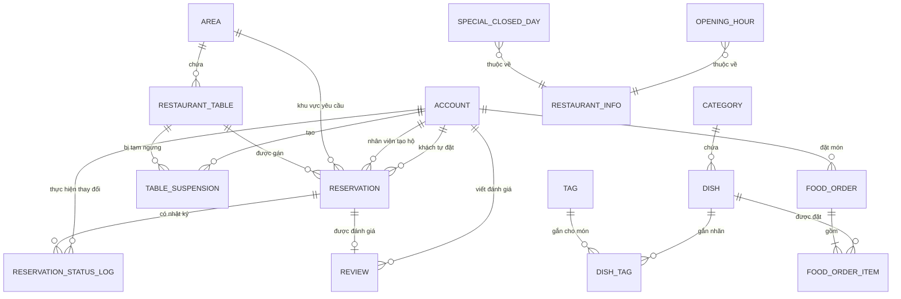

# Saga Res: Thiết kế ERD / Lược đồ database

| | |
|---|---|
| **Dự án** | Saga Res (nhà hàng demo: Sage) |
| **Tác giả** | Hùng |
| **Phiên bản** | 1.6 (đồng bộ thiết kế JWT stateless; không phát sinh bảng token) |
| **Tài liệu liên quan** | `01-project-summary.md`, `02-functional-requirements-and-business-rules.md`, `03-use-cases.md`, `07-food-ordering-basic-specification.md`, `08-food-ordering-customer-history-cancellation-price-snapshot.md`, `09-authentication-jwt-security-design.md` |
| **CSDL mục tiêu** | PostgreSQL 15+ (cần extension `btree_gist`) |

---

## 1. Nguyên tắc và quyết định thiết kế

| Vấn đề | Quyết định | Lý do |
|---|---|---|
| Khóa chính | `BIGINT GENERATED ALWAYS AS IDENTITY` cho mọi bảng | Đơn giản, hiệu năng tốt hơn UUID cho join/insert tuần tự; mã đặt bàn `SAGE-...` (BR-17) đã đóng vai trò "khóa nghiệp vụ" hiển thị cho khách, không cần PK là UUID |
| Thời gian | `TIMESTAMPTZ` cho mọi mốc giờ, hiển thị theo `Asia/Ho_Chi_Minh` ở tầng ứng dụng | Đúng BR-01 |
| Trạng thái (status) | `VARCHAR` + `CHECK (... IN (...))` thay vì `ENUM` gốc của Postgres | Enum gốc khó thêm giá trị mới (phải `ALTER TYPE`, không chạy trong transaction ở bản cũ); `CHECK` sửa dễ hơn khi yêu cầu thay đổi |
| Chống trùng bàn (BR-29, BR-30) | Cột sinh tự động `occupied_range tstzrange` + **exclusion constraint** dùng GiST | DB đảm bảo reservation-reservation không chồng; row lock trên `restaurant_table` vẫn cần ở tầng ứng dụng để tuần tự hóa với `table_suspension` vì suspension nằm ở bảng khác |
| Chống chồng lịch theo khách (BR-28) | Exclusion constraint riêng trên `reservation_range = [start_time,end_time)` | Không dùng buffer dọn bàn để chặn lịch khách; buffer chỉ thuộc tài nguyên bàn |
| Đệm dọn bàn, ngưỡng, hạn mức... | Bảng `business_config` (key–value) | Đúng NFR-05: không viết cứng trong code. Nhưng ràng buộc gần như không đổi (ví dụ số người 1–12 ở BR-11) vẫn để `CHECK` cứng trong DB làm lưới an toàn cuối cùng — xem mục 6 |
| Trạng thái tham gia chống trùng bàn | `PENDING`, `CONFIRMED`, `ARRIVED`, `COMPLETED` tham gia constraint bàn; customer constraint chỉ dùng `PENDING`, `CONFIRMED`, `ARRIVED` | `COMPLETED` vẫn phải giữ phần `occupied_range` còn lại để bảo toàn buffer dọn bàn; lịch khách không cần giữ sau khi hoàn thành |
| Đơn đặt hộ không có tài khoản (BR-39) | `customer_id` cho phép NULL, đi kèm `guest_name`, `guest_phone` | Theo đúng ghi chú ERD ở cuối tài liệu 02 |
| Xóa dữ liệu đã tham chiếu (BR-31) | Không có `ON DELETE CASCADE` cho bàn/món/danh mục; dùng cờ `is_active` / `status` để "ngừng dùng" | Đúng BR-31: đã dùng thì không xóa cứng |
| Nhật ký gửi email | **Không tạo bảng riêng** (quyết định D-02) | BR-46 chỉ yêu cầu ghi log, dùng log ứng dụng (SLF4J/Logback) là đủ cho MVP |
| Khu vực khách yêu cầu | Lưu `requested_area_id` nullable trên `reservation` | `table_id.area_id` là khu vực bàn hiện tại và có thể đổi khi staff chuyển bàn; không thể dùng nó thay cho lựa chọn ban đầu của khách |
| Chủ thể tạo đơn món | `food_order.customer_id` bắt buộc, chỉ CUSTOMER được tạo ở tầng ứng dụng | Theo quyết định 1B: không hỗ trợ guest checkout ở phiên bản cơ bản |
| Giá món trên order item | Lưu `unit_price` snapshot trên từng `food_order_item`; chưa lưu `total_amount` cố định | Giá lịch sử phải giữ đúng tại thời điểm đặt; tổng có thể tính từ `SUM(unit_price * quantity)` |
| Trạng thái đơn món | `PLACED`, `CANCELLED`; chỉ cho phép `PLACED → CANCELLED` bởi CUSTOMER sở hữu đơn | Đủ cho yêu cầu hủy tối thiểu mà chưa mở workflow giao hàng |
| Thanh toán đơn món | `payment_method = 'COD'` | Theo quyết định 5B; không tạo payment transaction/gateway |
| STAFF/ADMIN với đơn món | Read-only: xem danh sách và chi tiết | CUSTOMER history/cancel không làm thay đổi quyền vận hành của STAFF/ADMIN |
| JWT/session | Không tạo bảng access token, refresh token, session hoặc token blacklist trong MVP | JWT access token stateless TTL 1 giờ; account lock/role lấy từ bảng `account` khi xác thực request |

---

## 2. Sơ đồ ERD



*(`OPENING_HOUR`, `SPECIAL_CLOSED_DAY`, `RESTAURANT_INFO`, `BUSINESS_CONFIG` không có khóa ngoại vào các bảng nghiệp vụ khác — chúng được tầng ứng dụng đọc riêng khi cần. `REVIEW` có mặt trong sơ đồ nhưng chưa được triển khai migration thật — xem mục 3.13.)*

---

## 3. Chi tiết từng bảng

### 3.1 `account` — tài khoản

| Cột | Kiểu | Ràng buộc | Ghi chú |
|---|---|---|---|
| id | BIGINT IDENTITY | PK | |
| email | VARCHAR(255) | UNIQUE, NOT NULL | BR-34 |
| password_hash | VARCHAR(255) | NOT NULL | BCrypt, BR-36 |
| full_name | VARCHAR(255) | NOT NULL | |
| phone | VARCHAR(10) | NOT NULL, `CHECK (phone ~ '^0[0-9]{9}$')` | BR-35 |
| role | VARCHAR(20) | NOT NULL, `CHECK (role IN ('CUSTOMER','STAFF','ADMIN'))` | FR-AUTH-03 |
| is_locked | BOOLEAN | NOT NULL DEFAULT FALSE | FR-AUTH-08 |
| created_at | TIMESTAMPTZ | NOT NULL DEFAULT now() | |
| updated_at | TIMESTAMPTZ | NOT NULL DEFAULT now() | |

### 3.2 `restaurant_info` — thông tin nhà hàng (1 dòng duy nhất)

| Cột | Kiểu | Ràng buộc |
|---|---|---|
| id | SMALLINT | PK, `CHECK (id = 1)` — ép chỉ có 1 dòng |
| name, description, address, phone, contact_email | VARCHAR/TEXT | |
| cover_image_url | VARCHAR(500) | |
| updated_at | TIMESTAMPTZ | NOT NULL DEFAULT now() |

### 3.3 `opening_hour` — giờ mở cửa theo thứ (BR-02)

| Cột | Kiểu | Ràng buộc |
|---|---|---|
| day_of_week | SMALLINT | PK, `CHECK (day_of_week BETWEEN 0 AND 6)` (0 = Chủ nhật) |
| open_time | TIME | |
| close_time | TIME | `CHECK (close_time > open_time)` |
| is_closed | BOOLEAN | NOT NULL DEFAULT FALSE — thứ đó nghỉ hẳn |

### 3.4 `special_closed_day` — ngày đóng cửa đặc biệt (BR-10)

| Cột | Kiểu | Ràng buộc |
|---|---|---|
| id | BIGINT IDENTITY | PK |
| closed_date | DATE | UNIQUE, NOT NULL |
| reason | VARCHAR(255) | |

### 3.5 `area` — khu vực

| Cột | Kiểu | Ràng buộc |
|---|---|---|
| id | BIGINT IDENTITY | PK |
| name | VARCHAR(100) | UNIQUE, NOT NULL |
| description | TEXT | |
| is_active | BOOLEAN | NOT NULL DEFAULT TRUE |

### 3.6 `restaurant_table` — bàn (BR-12)

| Cột | Kiểu | Ràng buộc |
|---|---|---|
| id | BIGINT IDENTITY | PK |
| code | VARCHAR(20) | UNIQUE, NOT NULL — mã bàn hiển thị |
| area_id | BIGINT | FK → area, NOT NULL |
| min_capacity | SMALLINT | NOT NULL, `CHECK (min_capacity > 0)` |
| max_capacity | SMALLINT | NOT NULL, `CHECK (max_capacity >= min_capacity)` |
| is_active | BOOLEAN | NOT NULL DEFAULT TRUE |

Index gợi ý: `(area_id, is_active)` để lọc nhanh bàn theo khu vực (BR-14).

### 3.7 `table_suspension` — tạm ngưng bàn (FR-TBL-03)

| Cột | Kiểu | Ràng buộc |
|---|---|---|
| id | BIGINT IDENTITY | PK |
| table_id | BIGINT | FK → restaurant_table, NOT NULL |
| start_time, end_time | TIMESTAMPTZ | NOT NULL, `CHECK (end_time > start_time)` |
| reason | VARCHAR(255) | |
| created_by | BIGINT | FK → account |
| created_at | TIMESTAMPTZ | NOT NULL DEFAULT now() |

Khi tạo hoặc sửa suspension, transaction phải khóa row `restaurant_table` tương ứng trước, sau đó quét các reservation có `occupied_range` chồng để cảnh báo (BR-48) rồi mới ghi. Các luồng create/reschedule/move reservation cũng khóa cùng row bàn và kiểm tra `table_suspension` trước khi gán; row bàn là điểm tuần tự hóa chung để tránh race giữa booking và suspension.

### 3.8 `category` — danh mục món

| Cột | Kiểu | Ràng buộc |
|---|---|---|
| id | BIGINT IDENTITY | PK |
| name | VARCHAR(100) | UNIQUE, NOT NULL |
| display_order | INT | NOT NULL DEFAULT 0 |
| is_active | BOOLEAN | NOT NULL DEFAULT TRUE |

### 3.9 `dish` — món ăn

| Cột | Kiểu | Ràng buộc |
|---|---|---|
| id | BIGINT IDENTITY | PK |
| category_id | BIGINT | FK → category, NOT NULL |
| name | VARCHAR(255) | NOT NULL |
| description | TEXT | |
| price | INT | NOT NULL, `CHECK (price > 0)` — VND, BR-40 |
| image_url | VARCHAR(500) | |
| status | VARCHAR(20) | NOT NULL DEFAULT 'AVAILABLE', `CHECK (status IN ('AVAILABLE','SOLD_OUT','HIDDEN'))` — BR-41 |
| display_order | INT | NOT NULL DEFAULT 0 |
| created_at, updated_at | TIMESTAMPTZ | NOT NULL DEFAULT now() |

Index gợi ý: `(category_id, status)`; nếu cần tìm theo tên (FR-MENU-03) thêm `pg_trgm` + GIN index trên `name`.

### 3.10 `tag` / `dish_tag` — nhãn món (BR-43)

```
tag(id PK, name VARCHAR(50) UNIQUE NOT NULL)
dish_tag(dish_id FK, tag_id FK, PRIMARY KEY (dish_id, tag_id))
```

### 3.11 `reservation` — đơn đặt bàn (bảng trung tâm)

| Cột | Kiểu | Ràng buộc | Ghi chú |
|---|---|---|---|
| id | BIGINT IDENTITY | PK | |
| code | VARCHAR(20) | UNIQUE, NOT NULL | BR-17, sinh ở tầng ứng dụng |
| customer_id | BIGINT | FK → account, **NULL được** | NULL nếu là đơn đặt hộ theo khách vãng lai (BR-39) |
| guest_name | VARCHAR(255) | NULL được | Bắt buộc nếu customer_id NULL |
| guest_phone | VARCHAR(10) | NULL được | Bắt buộc nếu customer_id NULL |
| table_id | BIGINT | FK → restaurant_table, NOT NULL | Bàn hiện tại, gán bởi BR-13 |
| requested_area_id | BIGINT | FK → area, NULL được | Khu vực khách/nhân viên yêu cầu lúc đặt hoặc đổi lịch; NULL = không yêu cầu; không đổi khi staff chuyển bàn |
| party_size | SMALLINT | NOT NULL, `CHECK (party_size BETWEEN 1 AND 12)` | BR-11 |
| start_time | TIMESTAMPTZ | NOT NULL | |
| end_time | TIMESTAMPTZ | NOT NULL, `CHECK (end_time > start_time)` | |
| buffer_minutes | SMALLINT | NOT NULL | **Snapshot** giá trị đệm từ `business_config` tại thời điểm tạo/đổi lịch — xem mục 4 |
| reservation_range | TSTZRANGE | GENERATED ALWAYS AS (`tstzrange(start_time, end_time, '[)')`) STORED | Dùng cho exclusion constraint BR-28 của khách; không cộng buffer |
| occupied_range | TSTZRANGE | GENERATED ALWAYS AS (`tstzrange(start_time, end_time + (buffer_minutes || ' minutes')::interval, '[)')`) STORED | Dùng cho exclusion constraint tài nguyên bàn |
| status | VARCHAR(20) | NOT NULL, `CHECK (status IN ('PENDING','CONFIRMED','ARRIVED','COMPLETED','NO_SHOW','CANCELLED','REJECTED'))` | BR-18 |
| special_note | TEXT | | |
| reschedule_count | SMALLINT | NOT NULL DEFAULT 0, `CHECK (reschedule_count <= 2)` | BR-23 |
| created_by | BIGINT | FK → account, NULL được | Nhân viên tạo hộ; NULL = khách tự đặt |
| rejection_reason | TEXT | | Bắt buộc điền ở tầng ứng dụng khi status → REJECTED (BR: bảng chuyển trạng thái) |
| cancellation_reason | TEXT | | |
| reminder_sent_at | TIMESTAMPTZ | NULL được | Chống gửi nhắc lịch lặp (luồng job UC-25) |
| version | BIGINT | NOT NULL DEFAULT 0 | Optimistic locking, phải khớp `@Version` ở JPA |
| created_at, updated_at | TIMESTAMPTZ | NOT NULL DEFAULT now() | |

Ràng buộc dữ liệu bổ sung:
```sql
ALTER TABLE reservation ADD CONSTRAINT chk_customer_or_guest
  CHECK (
    (customer_id IS NOT NULL)
    OR (guest_name IS NOT NULL AND guest_phone IS NOT NULL AND created_by IS NOT NULL)
  );
```

### 3.12 `reservation_status_log` — nhật ký đơn (BR-32)

| Cột | Kiểu | Ràng buộc |
|---|---|---|
| id | BIGINT IDENTITY | PK |
| reservation_id | BIGINT | FK → reservation, NOT NULL |
| event_type | VARCHAR(30) | `CHECK (event_type IN ('CREATED','STATUS_CHANGED','TABLE_CHANGED','TIME_CHANGED','RESCHEDULED'))` |
| old_value | JSONB | NULL được |
| new_value | JSONB | |
| reason | TEXT | |
| changed_by | BIGINT | FK → account, NULL = hệ thống (job tự động) |
| changed_at | TIMESTAMPTZ | NOT NULL DEFAULT now() |

Index: `(reservation_id, changed_at)`.

### 3.13 `review` — đánh giá (COULD, FR-REV) — **thiết kế sẵn, chưa triển khai**

| Cột | Kiểu | Ràng buộc |
|---|---|---|
| id | BIGINT IDENTITY | PK |
| reservation_id | BIGINT | FK → reservation, **UNIQUE**, NOT NULL |
| customer_id | BIGINT | FK → account, NOT NULL |
| rating | SMALLINT | NOT NULL, `CHECK (rating BETWEEN 1 AND 5)` |
| comment | TEXT | |
| is_hidden | BOOLEAN | NOT NULL DEFAULT FALSE |
| created_at | TIMESTAMPTZ | NOT NULL DEFAULT now() |

Theo quyết định D-03: bảng này **chưa có migration/entity thật** ở giai đoạn MVP. Giữ lại thiết kế ở đây để dùng ngay khi triển khai tính năng đánh giá — lúc đó chỉ cần thêm 1 migration mới, không phải thiết kế lại. Ứng dụng chỉ cho tạo khi `reservation.status = 'COMPLETED'` và trong 14 ngày (BR-47).

### 3.14 `business_config` — cấu hình nghiệp vụ (NFR-05)

| Cột | Kiểu | Ràng buộc |
|---|---|---|
| config_key | VARCHAR(100) | PK |
| config_value | VARCHAR(255) | NOT NULL |
| description | TEXT | |
| updated_at | TIMESTAMPTZ | NOT NULL DEFAULT now() |

### 3.15 `food_order` — đơn món giao hàng cơ bản

| Cột | Kiểu | Ràng buộc | Ghi chú |
|---|---|---|---|
| id | BIGINT IDENTITY | PK | Mã nội bộ của đơn; phiên bản cơ bản chưa cần mã public riêng |
| customer_id | BIGINT | FK → account, NOT NULL | Chỉ CUSTOMER được tạo đơn ở tầng ứng dụng, BR-51 |
| delivery_phone | VARCHAR(30) | NOT NULL | Chưa áp dụng rule định dạng riêng ngoài validation không rỗng |
| delivery_address | TEXT | NOT NULL | Chưa áp dụng vùng giao/chuẩn hóa địa chỉ |
| status | VARCHAR(20) | NOT NULL DEFAULT `'PLACED'`, `CHECK (status IN ('PLACED','CANCELLED'))` | BR-53 |
| payment_method | VARCHAR(20) | NOT NULL DEFAULT `'COD'`, `CHECK (payment_method = 'COD')` | Thanh toán khi nhận hàng, BR-54 |
| cancelled_at | TIMESTAMPTZ | NULL được | Ghi khi CUSTOMER hủy đơn theo BR-58; NULL khi còn `PLACED` |
| created_at | TIMESTAMPTZ | NOT NULL DEFAULT now() | Dùng sắp xếp history CUSTOMER và danh sách STAFF/ADMIN |

Không có `total_amount`, `payment_status`, `delivery_fee` hoặc `delivery_status`; tổng đơn được tính từ giá snapshot ở item. Việc tài khoản mang role `CUSTOMER` được kiểm tra ở tầng service/API; FK chỉ đảm bảo account tồn tại. Ràng buộc logic `CANCELLED => cancelled_at IS NOT NULL` nên được bảo vệ ở service và có thể bổ sung `CHECK` trong migration.

### 3.16 `food_order_item` — món trong đơn giao hàng

| Cột | Kiểu | Ràng buộc | Ghi chú |
|---|---|---|---|
| id | BIGINT IDENTITY | PK | |
| food_order_id | BIGINT | FK → food_order, NOT NULL | Thuộc một đơn món |
| dish_id | BIGINT | FK → dish, NOT NULL | Món được chọn |
| quantity | INT | NOT NULL, `CHECK (quantity > 0)` | Validation tối thiểu BR-50 |
| unit_price | INT | NOT NULL, `CHECK (unit_price > 0)` | Snapshot `dish.price` tại thời điểm tạo item, BR-52 |

`unit_price` là dữ liệu lịch sử bất biến của order item. Sau khi đơn được tạo, hiển thị giá và tính tổng phải dùng `food_order_item.unit_price`, không đọc lại `dish.price`; tổng đơn có thể tính bằng `SUM(unit_price * quantity)` nên chưa cần cột `total_amount`.

Không hỗ trợ sửa nội dung order sau khi gửi. CUSTOMER chỉ có command hủy `PLACED → CANCELLED`; `dish` đã được `food_order_item` tham chiếu phải tuân BR-31: ngừng dùng thay vì xóa cứng.

---

## 4. Ràng buộc chống trùng — trọng tâm kỹ thuật (BR-29, BR-30, BR-28)

```sql
CREATE EXTENSION IF NOT EXISTS btree_gist;

-- 1) Không hai đơn chiếm cùng một bàn chồng occupied_range.
-- COMPLETED vẫn tham gia để bảo toàn phần buffer còn lại sau khi khách rời bàn.
ALTER TABLE reservation
  ADD CONSTRAINT reservation_table_no_overlap
  EXCLUDE USING gist (
    table_id WITH =,
    occupied_range WITH &&
  )
  WHERE (status IN ('PENDING', 'CONFIRMED', 'ARRIVED', 'COMPLETED'));

-- 2) Một khách không có hai lượt ăn thực tế chồng nhau (BR-28).
-- Không dùng occupied_range vì buffer là thời gian dọn bàn, không phải lịch của khách.
ALTER TABLE reservation
  ADD CONSTRAINT reservation_customer_no_overlap
  EXCLUDE USING gist (
    customer_id WITH =,
    reservation_range WITH &&
  )
  WHERE (status IN ('PENDING', 'CONFIRMED', 'ARRIVED') AND customer_id IS NOT NULL);
```

- `occupied_range` đã cộng sẵn đệm dọn bàn (BR-07), nên constraint (1) đảm bảo hai reservation trên cùng bàn chỉ có thể liền kề khi reservation trước đã chừa đủ buffer. `COMPLETED` vẫn tham gia constraint này; vì range có thời điểm kết thúc hữu hạn nên sau khi `end_time + buffer` trôi qua nó không cản booking tương lai.
- `CANCELLED`, `REJECTED`, `NO_SHOW` không tham gia constraint bàn và giải phóng ngay.
- Constraint (2) dùng `reservation_range` không cộng buffer, đúng BR-28: khách có thể có booking kế tiếp bắt đầu đúng lúc booking trước kết thúc, miễn hai lượt ăn không chồng nhau.
- `buffer_minutes` **phải lưu snapshot trên từng đơn**, không đọc trực tiếp từ `business_config` lúc query — nếu sau này admin đổi giá trị đệm mặc định, các đơn cũ vẫn giữ đúng khoảng đã cam kết lúc đặt, tránh vỡ dữ liệu lịch sử.
- Tầng ứng dụng vẫn phải bắt lỗi `23P01` (exclusion violation) từ cả hai constraint và trả về đúng mã lỗi nghiệp vụ tương ứng — "hết chỗ" cho (1), "bạn đã có đơn trùng giờ" cho (2) (NFR-06).

**BR-27** (tối đa 3 đơn đang hoạt động mỗi khách) không diễn đạt được bằng constraint đơn giản. Không dùng `COUNT(...) FOR UPDATE`: transaction tạo đơn phải `SELECT` row `account` của khách `FOR UPDATE` trước, rồi `COUNT` các reservation `PENDING`/`CONFIRMED` và insert nếu còn dưới giới hạn. Hai request tạo đơn cho cùng customer vì vậy được serialize trên cùng row `account`.

---

## 5. Index quan trọng (phục vụ NFR-02: tra cứu giờ trống < 500ms)

| Bảng | Index | Mục đích |
|---|---|---|
| reservation | GiST trên `(table_id, occupied_range)` và `(customer_id, reservation_range)` | Tự động sinh kèm hai exclusion constraint ở mục 4 |
| reservation | B-tree trên `start_time` | Lấy toàn bộ đơn "trong ngày" bằng một truy vấn (theo đúng gợi ý NFR-02), rồi tính giờ trống trong bộ nhớ |
| reservation | `(customer_id, status)` | Đếm đơn hoạt động (BR-27), tra "đơn của tôi" (FR-RSV-08) |
| restaurant_table | `(area_id, is_active)` | Lọc bàn theo khu vực (BR-14) |
| dish | `(category_id, status)` | Trang menu theo danh mục |
| reservation_status_log | `(reservation_id, changed_at)` | Xem nhật ký một đơn (UC-19) |
| food_order | `(customer_id, created_at DESC)` | CUSTOMER xem lịch sử của chính mình (UC-37); đồng thời hỗ trợ lọc theo owner |
| food_order | `(created_at)` | STAFF/ADMIN xem danh sách đơn mới nhất (UC-36) |
| food_order_item | `(food_order_id)` | Tải chi tiết các item của một đơn (UC-36) |

---

## 6. Seed gợi ý cho `business_config`

| config_key | Giá trị đề xuất | Nguồn |
|---|---|---|
| buffer_minutes | 15 | BR-06 |
| min_advance_hours | 2 | BR-08 |
| min_advance_hours_large_group | 4 | BR-08 |
| large_group_threshold | 7 | BR-20 |
| max_advance_days | 30 | BR-09 |
| max_party_size | 12 | BR-11 |
| auto_confirm_threshold | 6 | BR-20 |
| cancel_change_deadline_hours | 2 | BR-22 |
| max_reschedule_count | 2 | BR-23 |
| no_show_grace_minutes | 15 | BR-25 |
| pending_auto_cancel_hours | 3 | BR-21 |
| reminder_hours_before | 3 | BR-45 |
| max_active_reservations_per_customer | 3 | BR-27 |
| time_slot_step_minutes | 15 | BR-03 |
| default_duration_minutes | 90 | BR-04 |
| min_duration_minutes | 60 | BR-04 |
| max_duration_minutes | 180 | BR-04 |

`max_party_size` xuất hiện ở cả đây lẫn `CHECK` cứng trên bảng `reservation` (mục 3.11) — đây là lựa chọn có chủ đích: DB giữ giới hạn cứng an toàn (12), còn `business_config` cho phép đội vận hành *siết chặt hơn* nếu cần (ví dụ tạm giảm xuống 8 người vào ngày đông khách) mà không cần đổi schema.

---

## 7. Quyết định bổ sung đã xác nhận

| Mã | Vấn đề | Quyết định | Cập nhật ở mục |
|---|---|---|---|
| D-01 | Chống chồng lịch theo khách (BR-28) chỉ kiểm tra ở tầng ứng dụng hay thêm cả DB? | Thêm exclusion constraint thứ hai vào DB. **Range sử dụng đã được D-10 sửa từ `occupied_range` sang `reservation_range`** | Mục 1, 4, 5 |
| D-02 | Có cần bảng `notification_log` riêng không? | Không tạo ở MVP — dùng log ứng dụng, BR-46 không đòi hỏi lưu DB | Mục 1 (đã bỏ mục 3.14 cũ) |
| D-03 | Bảng `review` (COULD) có tạo migration ngay không? | Giữ thiết kế trong tài liệu, chưa tạo migration/entity thật | Mục 3.13 |
| D-04 | Cột `area_id_requested` trên `reservation` giữ hay bỏ? | **Thay thế bởi D-09:** sau rà soát xác định không thể suy ra tin cậy khi staff chuyển bàn | Mục 1, 3.11 |
| D-05 | `COMPLETED` có tiếp tục chặn bàn trong buffer không? | Có; thêm `COMPLETED` vào predicate của `reservation_table_no_overlap` | Mục 1, 4 |
| D-06 | BR-27 serialize concurrent create như thế nào? | Lock row `account` trước khi COUNT + INSERT; không dùng aggregate `FOR UPDATE` | Mục 4 |
| D-07 | Booking và table suspension chống race bằng cách nào? | Dùng row `restaurant_table` làm serialization point chung; cả hai phía lock bàn trước khi kiểm tra và ghi | Mục 3.7, service contract |
| D-08 | `Reservation.version` trong JPA có cần cột DB không? | Có; thêm `version BIGINT NOT NULL DEFAULT 0` | Mục 3.11 |
| D-09 | Có lưu khu vực khách yêu cầu không? | Có; thêm `requested_area_id` nullable, độc lập với khu vực của bàn hiện tại | Mục 1, 3.11 |
| D-10 | Customer overlap có dùng buffer không? | Không; thêm `reservation_range = [start_time,end_time)` và dùng range này cho constraint customer | Mục 3.11, 4, 5 |
| D-11 | State transition `CONFIRMED → PENDING` nằm ở đâu? | Đây là rule ứng dụng sau reschedule; schema status giữ nguyên, optimistic lock `version` bảo vệ concurrent update | Mục 3.11; tài liệu use case |
| D-12 | Ai được tạo đơn món giao hàng? | Chỉ CUSTOMER đã đăng nhập; `food_order.customer_id NOT NULL` | Mục 1, 3.15 |
| D-13 | Có snapshot giá món không? | Có; `food_order_item.unit_price` bắt buộc, copy từ `dish.price` tại thời điểm tạo item | Mục 1, 3.16 |
| D-14 | Vòng đời đơn món hiện tại? | `PLACED`, `CANCELLED`; chỉ có transition `PLACED → CANCELLED` do CUSTOMER sở hữu đơn | Mục 1, 3.15 |
| D-15 | STAFF/ADMIN thao tác gì với đơn món? | Chỉ xem danh sách/chi tiết; không update status | Mục 1, 3.15–3.16 |
| D-16 | Thanh toán đơn món? | COD; lưu `payment_method=COD`, không có payment gateway/transaction | Mục 1, 3.15 |
| D-17 | CUSTOMER có lịch sử đơn không? | Có; query theo `customer_id`, mới nhất trước; ownership bắt buộc ở service/API | Mục 3.15, 5 |
| D-18 | Lưu thông tin hủy tối thiểu thế nào? | Thêm `food_order.cancelled_at`; không tạo status log riêng ở giai đoạn này | Mục 3.15 |
| D-19 | Tổng đơn lưu hay tính? | Chưa lưu `total_amount`; tính từ `SUM(food_order_item.unit_price * quantity)` | Mục 3.16 |
| D-20 | Có lưu JWT/refresh token trong DB không? | Không. MVP chỉ dùng access token stateless TTL 1 giờ; không refresh token, blacklist hoặc token table | Mục 1; tài liệu 09 |

Phần database cho **đặt bàn/menu/tài khoản** và schema **đặt món giao hàng có lịch sử/hủy/snapshot giá** đã chốt ở mức đủ để viết migration. Các tính năng vận hành giao hàng nâng cao vẫn để sau.


---

## 8. Phạm vi schema đặt món giao hàng đã chốt

Schema food order ở phiên bản này cố ý tối giản:

- `food_order` bắt buộc gắn CUSTOMER qua `customer_id`.
- Thông tin nhận hàng chỉ gồm `delivery_address` và `delivery_phone`.
- Trạng thái gồm `PLACED`, `CANCELLED`; transition duy nhất là `PLACED → CANCELLED` bởi owner.
- `cancelled_at` ghi thời điểm hủy.
- Phương thức thanh toán duy nhất là `COD`; không có bảng payment.
- `food_order_item` lưu `dish_id` + `quantity` + `unit_price` snapshot.
- CUSTOMER có lịch sử/chi tiết theo ownership; STAFF/ADMIN vẫn chỉ đọc danh sách/chi tiết.
- Chưa có delivery fee/zone, tracking, ETA, inventory, promotion, edit order, notification hoặc các trạng thái giao hàng khác.

Đặc tả thay đổi tương ứng nằm ở `08-food-ordering-customer-history-cancellation-price-snapshot.md`.
